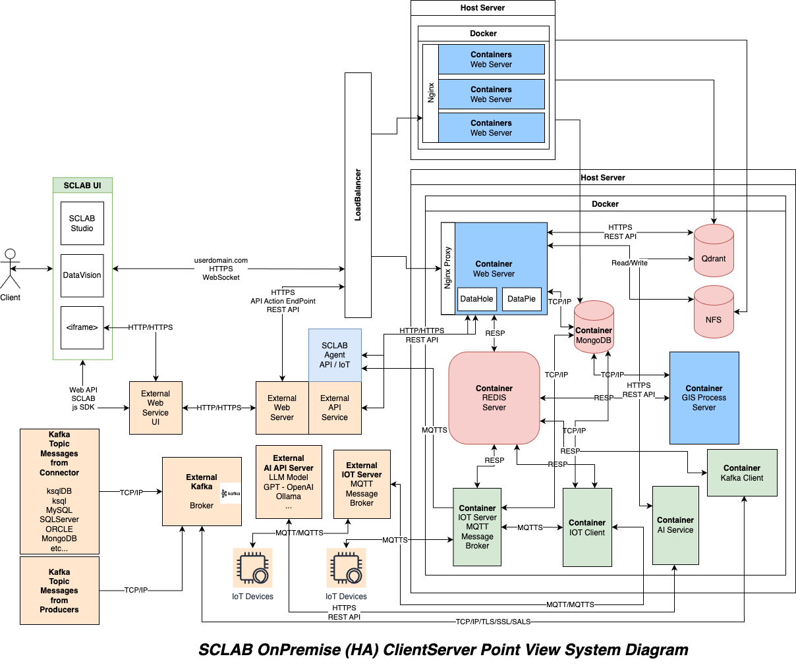

# SCLAB HA

> English version: [README.md](README.md)

## 설명

이 문서는 HA 구성을 보여 주는 예시입니다.

이 예시는 2대의 Ubuntu 서버에 설치할 수 있습니다. 예시에서는 모든 서비스를 서버 1에 설치하고, 웹앱 10개 인스턴스를 서버 2에 구성합니다. 실제 운영 환경에서는 MongoDB, Redis, Qdrant 같은 서비스는 Managed Service로 두는 것이 권장되지만, 직접 관리해서 사용할 수도 있습니다.

이 예시에는 LoadBalancer가 포함되어 있지 않습니다. ALB, ELB 또는 L4 스위치 서버 같은 장비를 앞단에 별도로 배치해 주세요.

## 방화벽 포트

| 포트 | 서비스 |
|---|---|
| 22 | SSH |
| 80 | HTTP |
| 443 | HTTPS |
| 27017 | MongoDB |
| 6379 | Redis |
| 6333 | Qdrant |
| 8883 | MQTT |
| 8888 | MQTT over WebSocket |
| 7890 | SCLAB Agent (HTTPS) |
| 2049 | NFS |

## 설치

- [Master](./master/README.md)
- [Slave](./slave/README.md)

## 시스템 다이어그램

## 라이선스

Copyright (c) 2024 SCLAB All rights reserved.
