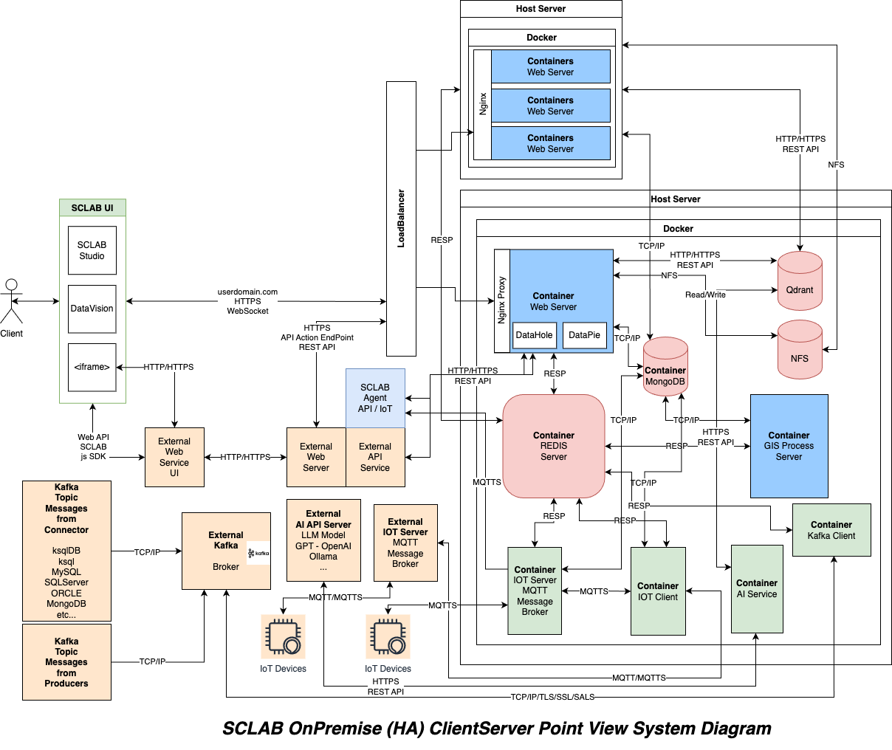

SCLAB HA
===================

## Description

This is an example of an HA configuration. 
You can install it on two Ubuntu servers. 
In this example, all services are installed on server 1, and 10 instances of the webapp are set up on server 2. 
In a real production environment, it is recommended to set up services like MongoDB, Redis, and Qdrant as Managed Services, but you can also manage and use them directly. 
This example does not include a LoadBalancer. Please set up a LoadBalancer in front, such as an ALB, ELB, or an L4 switch server.

## Port numbers for Firewall
| Port  | Service             |
|-------|---------------------|
| 22    | SSH                 |
| 80    | HTTP                |
| 443   | HTTPS               |
| 27017 | MongoDB             |
| 6379  | Redis               |
| 6333  | Qdrant              |
| 8883  | MQTT                |
| 8888  | MQTT over WebSocket |
| 7890  | SCLAB Agent (HTTPS) |
| 2049  | NFS                 |

## Installation

- [Master](./master/README.md)
- [Slave](./slave/README.md)

## System diagram

## License

Copyright (c) 2024 SCLAB All rights reserved.
